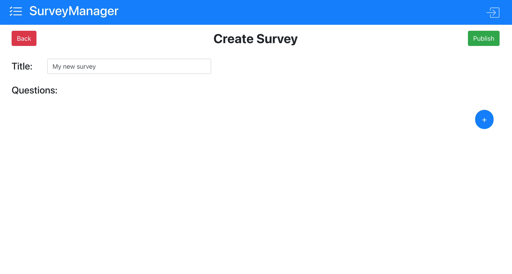
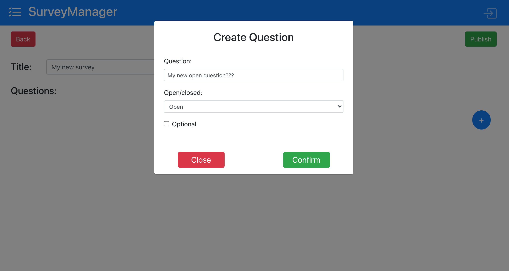
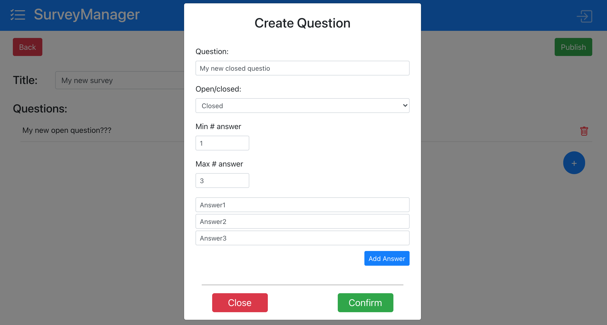
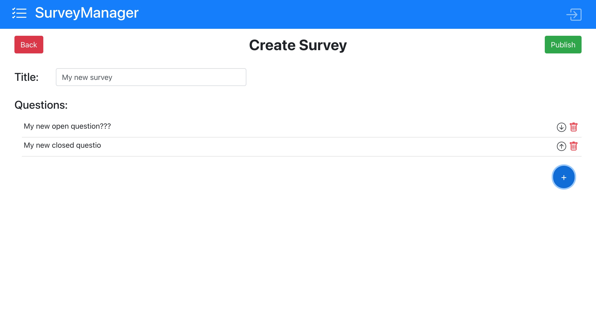

# Exam #1: "Survey"
## Student: s283421 MACORI PIETRO 

## React Client Application Routes

- Route `/`: main page seen by standard user, welcome message and list of surveys
- Route `/survey/:surveyID`: page showing the list of questions to be answered of a survey. Its accessible by all users. <surveyID> is the survey ID of the survey the user is responding to
- Route `/login`: page diplaying a form to be filled in order to login as admin
- Route `/admin`: main page of an admin. After login the admin is redirected here. Shows the list of surveys created by the logged admin
- Route `/admin/create`: page used to create a new survey. Allows to insert the survey name and add new questions (questions are created using a modal so there is not a new route for this functionality)


## API Server

- GET `/api/:adminID/surveys`
  - Description: Retrieve all surveys created by a given admin
  - Request: <adminID> is the ID of the currently logged user
  - Response: `200 OK` (success) - Return an array of JSON object representing each survey <br/>
  - Error response: `500 Internal Server Error` (generic error)
  - Response body:
```
[
  {surveyID: 1, adminID: 1, title: "First", numResp: 5},
  {surveyID: 2, adminID: 1, title: "Second", numResp: 6},
  ...
]
```

- GET `/api/surveys`
  - Description: Retrieve all surveys
  - Request: none
  - Response: `200 OK` (success) - Return an array of JSON object representing each survey <br/>
  - Error response: `500 Internal Server Error` (generic error)
  - Response body:
```
[
  {surveyID: 1, adminID: 1, title: "First"},
  {surveyID: 3, adminID: 2, title: "Third"},
  ...
]
```
  

- POST `/api/:adminID/survey`
  - Description: Record the creating of a new survey by a given admin
  - Request: <adminID> is the ID of the admin that creates the survey
  - Request body:

```
{title: 1, listQuestions: [{surveyID:1, text:"Domanda1", open:0, min:1, max:1, answerList: "a,b,c"},...]}
```
  - Response: `200 OK` (success) <br/>
  - Error response: `500 Internal Server Error` (generic error)


- GET `/api/:surveyID/questions`
  - Description: Retrieve all surveys
  - Request: <surveyID> is the ID of the survey of which we want to see the question
  - Response: `200 OK` (success) - Return an array of JSON object representing each question of the survey <br/>
  - Error response: `500 Internal Server Error` (generic error)
  - Response body:
```
[
  {
    "questionID": 1, "surveyID": 1, "text": "Do you own an Apple product?",
    "open": 0, "max": 1, "min": 1, "answerList": "Yes,No,I don't know"
  },
  {
    "questionID": 2, "surveyID": 1, "text": "What is your favorite Apple product",
    "open": 0, "max": 2, "min": 0, "answerList": "iPhone,iPad,iMac,iPod,MacBook"
  }, ...
]
```
- POST `/api/response/:surveyID`
  - Description: Send to the server the responses to a survey
  - Request: <surveyID> is the ID of the survey to which we are responding
  - Request body:
```
[
  {questionID: 1, response: ["No"] ,surveyID: 1, userName: "Gianni"},
  {questionID: 3, response: ["Beautiful phones!"], surveyID: 1, userName: "Gianni"},
  ...
]
```
  - Response: `200 OK` (success) <br/>
  - Error response: `500 Internal Server Error` (generic error)

- GET `/api/:surveyID/users`
  - Description: Retrieve all user that responded to a given survey
  - Request: <surveyID> is the ID of the survey of which we want to retrieve the user that responded
  - Response: `200 OK` (success) - Return an array of JSON object representing each user responding <br/>
  - Error response: `500 Internal Server Error` (generic error)
  - Response body:
```
[{"userID": 1},{"userID": 2},...]
```

- POST `/api/login`
  - Description: Login a user into the system
  - Request: *none*
  - Response: `200 OK` (success)<br/>
  - Error response: `500 Internal Server Error` (generic error)<br/>
  - Request body: A JSON object representing the user credentials

```
{
  "username": "pietro@polito.it",
  "password": "1234"
}
```


## Database Tables

- Table `Admin` - contains **adminID** - **email** - **hash**
  - Table containing info on admins. **AdminID** is an internal ID used by the server, **email** is the username, **hash** is the hashed password of the user
- Table `Survey` - contains **surveyID** - **adminID** - **title**
  - Table containing info on all surveys created. **surveyID** is an internal ID, **adminID** is the ID of the admin that created the survey, **title** is the title of the survey
- Table `Question` - contains **questionID** - **surveyID** - **text** - **open** - **max** - **min** - **answerList**
  - Table storing the questions of all surveys created. **questionID** is an internal ID, **surveyID** is the survey to which the question is related to, **text** is the question text, **open**, **close** and **min** are the parameters of the question. **answerList** contains a string of comma separated possible answers if the question is closed, NULL if the question is open.
- Table `Response` - contains **responseID** - **questionID** - **surveyID** - **response** - **userName** - **userID**
  - Table storing all responses to various questions of surveys. **responseID** is an internal ID, **questionID** is the reference to the question to which the response is related, **surveyID** is the survey o which the question belongs. **response** is the actual user response (comma separated string for closed questions). **userName** contains the name of the user and **userID** is an internal ID to discriminate between users with the same name.

## Main React Components

- `CreateSurvey` (in `CreateSurvey.js`): component that displays the form to insert the new survey title and add new questions. It also has a list of created questions
- `QuestionRow` (in `CreateSurvey.js`): component displayed in the list of questions. It has 3 buttons allowing to delete, and move up or down the question
- `CreateQuestionModal` (in `CreateSurvey.js`): displays the modal used to create a new question. Has a form to contain all info about the question (question text, open/closed, ...) 
- `LeftSideAdmin` (in `LeftSideAdmin.js`): component that shows on the left the list of created surveys by an admin
- `LeftSideUser` (in `LeftSideUser.js`): component that shows on the left the list of avaiable surveys
- `LoginForm` (in `Login.js`): component that displays a form containing textboxes for username and password, it also shows a button to login.
- `MyNavBar` (in `MyNavBar.js`): component that shows the navbar on the top of every page. It has the website name, the logo, the login button (if the user is not logged) or a logout button (if admin is logged)
- `ShowSurvey` (in `ShowSurvey.js`): component that displays the results of a choosen survey. It's used only by the admin and it shows the name of the user that responded and two arrows to move between users.
- `MyNavBar` (in `ShowSurvey.js`): component that shows the navbar on the top of every page. It has the website name, the logo, the login button (if the user is not logged) or a logout button (if admin is logged)
- `ShowSurveyUser` (in `ShowSurveyUser.js`): component that is used to display the questions of a survey and the forms for the answer.

## Screenshot







## Users Credentials

- ADMIN 1:
  - username: `pietro@polito.it`, password: `1234`
    - Survey 1: **Apple brand recognition**
    - Survey 2: **Food habits**
- ADMIN 2:
  - username: `prof@polito.it`, password: `abcd`
    - Survey 3: **WA1 course review**
    - Survey 4: **PoliTo review**
